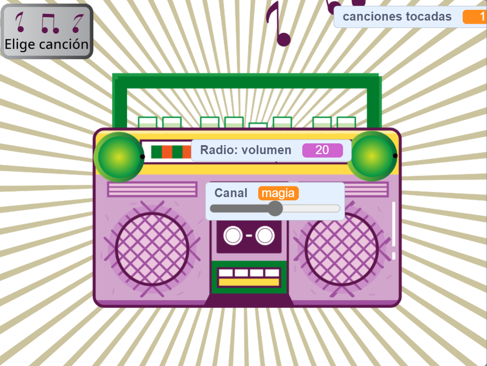

## Lo que harás

Crea una mascota virtual, un personaje o una simulación de la naturaleza con la que el usuario pueda interactuar para ayudarlo. Tu juego deberá cumplir con el **resumen del proyecto**.

Los juegos de mascotas virtuales son un tipo de juego en el que los usuarios interactúan con los personajes para satisfacer sus necesidades. ¡Es posible que hayas jugado con un pequeño Tamagotchi de mano o disfrutado de juegos como Catz y Adopt me! en una computadora. ¿Se te ocurre algún otro juego de mascotas virtuales?

Vas a:
+ Hacer un personaje o una simulación con la que sea divertido o interesante interactuar
+ Usar cualquier combinación de `variables`{:class="block3variables"}, bloques `enviar`{:class="block3events"} y `si`{:class="block3control"}, con las habilidades que ya ha aprendido, permitir que un usuario satisfaga las necesidades de un personaje
+ Comprender cómo los personajes en juegos y aplicaciones son controlados por algoritmos

--- no-print --- --- task ---

### Reproducir ▶️

Interactúa con Cricket el murciélago. ¿Qué sucede si haces clic en los objetos de comida o agua? ¿Cómo puedes saber si el murciélago tiene hambre o sed?

**Simulador de murciélagos**: [Ver interior](https://scratch.mit.edu/projects/530008968/editor){:target="_blank"}

  <iframe allowtransparency="true" width="485" height="402" src="https://scratch.mit.edu/projects/embed/530008968/?autostart=false" frameborder="0"></iframe>

--- /task ---

--- /no-print ---

### RESUMEN DEL PROYECTO: Ayúdame a crecer

Necesitas crear una mascota virtual, una planta u otra simulación con la que el usuario pueda interactuar para satisfacer sus necesidades. Usarás **variables** para realizar un seguimiento de cómo le está yendo a tu objeto principal. Puede estar feliz, aburrido, sediento o somnoliento. 

Tu simulación debería:
+ Usar al menos una `variable`{:class="block3variables"} para realizar un seguimiento de lo que necesita el objeto principal
+ Tener una forma para que la(s) variable(s) cambie(n) automáticamente
+ Darle al usuario una forma de mejorar las variables para darle al objeto principal lo que necesita
+ Usar bloques `si`{:class="block3control"} para controlar cuándo suceden las cosas
+ Usar bloques `enviar`{:class="block3events"} para comunicarse entre otros objetos y el objeto principal

Tu simulación podría:
+ Tener un mensaje, como amabilidad o mantener los cultivos saludables
+ Alertar al usuario cuando los niveles son demasiado altos o bajos
+ Permitir al usuario chatear con su objeto, o cambiar su nombre

--- no-print ---

### Obtén ideas 💭

--- task ---

Piensa en lo que elegirás como objeto principal. Podría ser una mascota que el usuario cuida, una persona a la que el usuario ayuda a tomar buenas decisiones, una planta o un cultivo que el usuario ayuda a crecer, o un objeto de la naturaleza o de fantasía para el cual el usuario necesita para crear las condiciones adecuadas.

**Hacer un arcoíris**: [Ver adentro](https://scratch.mit.edu/projects/530034441/editor){:target="_blank"}

  <iframe allowtransparency="true" width="485" height="402" src="https://scratch.mit.edu/projects/embed/530034441/?autostart=false" frameborder="0"></iframe>

**Agricultor de sandías**: [Ver dentro](https://scratch.mit.edu/projects/531858794/editor){:target="_blank"}

  <iframe allowtransparency="true" width="485" height="402" src="https://scratch.mit.edu/projects/embed/531858794/?autostart=false" frameborder="0"></iframe>

**Máquina de música**: [Ver dentro](https://scratch.mit.edu/projects/532093585/editor){:target="_blank"}

  <iframe allowtransparency="true" width="485" height="402" src="https://scratch.mit.edu/projects/embed/532093585/?autostart=false" frameborder="0"></iframe>

--- /task ---

--- /no-print ---

--- print-only ---

### Obtén ideas 💭

Piensa en lo que elegirás como objeto principal. Podría ser una mascota que el usuario cuida, una persona a la que el usuario ayuda a tomar buenas decisiones, una planta o un cultivo que el usuario ayuda a cultivar, o un objeto de la naturaleza o de fantasía para el cual el usuario necesita crear las condiciones adecuadas.

**Ver adentro** proyectos de ejemplo en el estudio Scratch 'Este sprite te necesita — Ejemplos': https://scratch.mit.edu/studios/29683913/

   

--- /print-only ---

