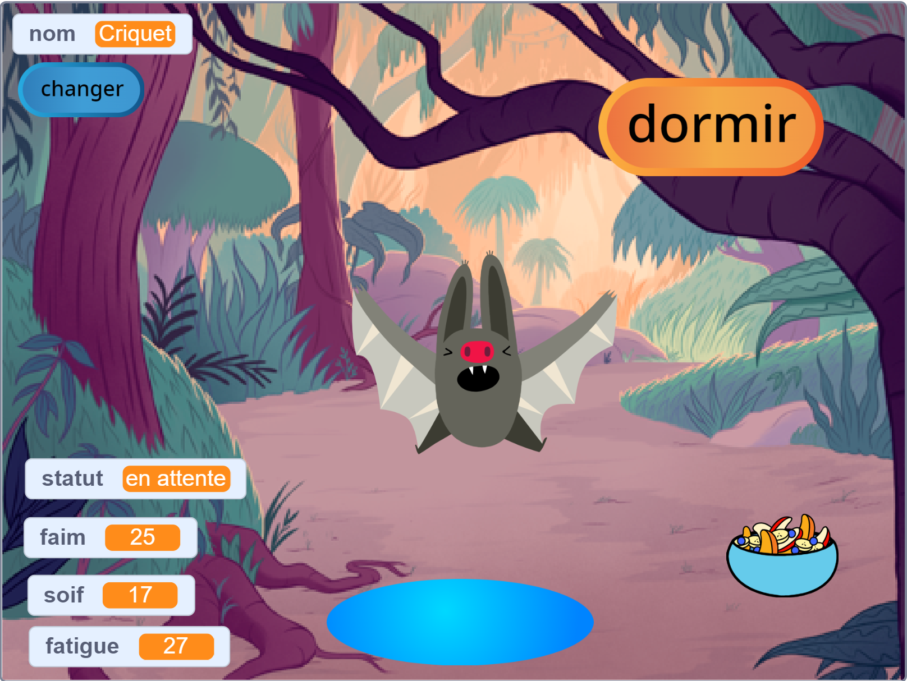
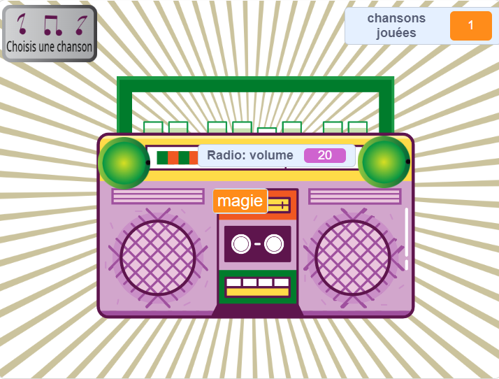
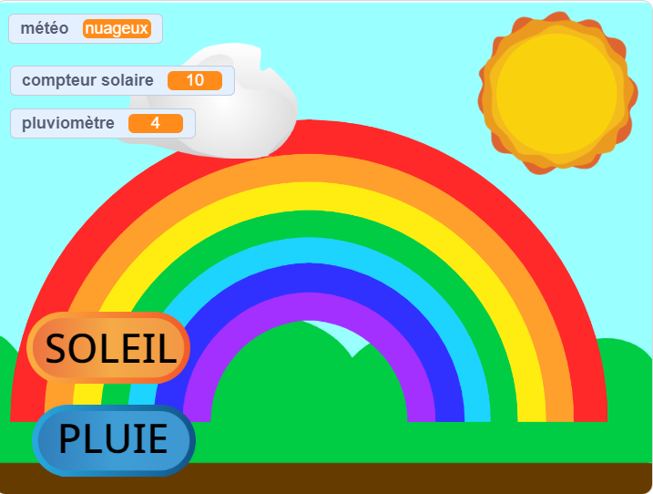

## You will make

Crée une simulation virtuelle d'animal de compagnie, de personnage ou de nature avec laquelle l'utilisateur peut interagir pour l'aider. Ton jeu devra respecter la **fiche de projet**.

Les jeux d'animaux de compagnie virtuels sont un type de jeu où les utilisateurs interagissent avec les personnages pour répondre aux besoins des personnages. Tu t'es peut-être amusé avec un petit Tamagotchi portable ou avec des jeux comme « Catz » et « Adoptez-moi ! » sur un ordinateur. Peux-tu penser à d'autres exemples de jeux d'animaux virtuels ?

Tu vas devoir :
+ Créer un personnage ou une simulation amusante ou intéressante avec laquelle interagir
+ Utiliser n'importe quelle combinaison de blocs `variables`{:code="bloc::variables"},`envoyer à tous`{: code ="bloc::events"}, et `si`{: code ="bloc::control"}, avec les compétences que tu as déjà acquises, pour permettre à un utilisateur de répondre aux besoins d'un personnage
+ Comprendre comment les personnages des jeux et des applications sont contrôlés par des algorithmes

--- no-print --- --- task ---

### Play ▶️ 

Interact with Cricket the bat. Que se passe-t-il si tu cliques sur les sprites de nourriture ou d'eau ? Comment peux-tu savoir si la chauve-souris a faim ou soif ?

**Le simulateur de chauve-souris** : [Voir à l'intérieur](https://scratch.mit.edu/projects/530008968/editor){:target="_blank"}

  <iframe allowtransparency="true" width="485" height="402" src="https://scratch.mit.edu/projects/embed/530008968/?autostart=false" frameborder="0"></iframe>

--- /task ---

--- /no-print ---

### PRÉSENTATION DU PROJET : Aide-moi à grandir

Tu dois créer un animal de compagnie virtuel, une plante ou une autre simulation avec laquelle l'utilisateur peut interagir pour répondre à ses besoins. Tu vas utiliser des **variables** pour suivre l'évolution de ton sprite principal. Il peut être heureux, s'ennuyer, avoir soif ou être endormi. 

Ta simulation doit :
+ Utiliser au moins une « variable »{:code="bloc::variables"} pour garder une trace de ce dont le sprite principal a besoin
+ Avoir un moyen pour que la ou les variable(s) changent automatiquement
+ Donner à l'utilisateur une façon d'améliorer les variables pour donner au sprite principal ce dont il a besoin
+ Utiliser des blocs « si »{:code ="bloc::control"} pour contrôler quand des choses se produisent
+ Utiliser des blocs « envoyer à tous »{:code ="bloc::events"} pour communiquer entre d'autres sprites et le sprite principal

Ta simulation pourrait :
+ Avoir un message, comme la gentillesse ou garder les récoltes en bonne santé
+ Alerter l'utilisateur lorsque les niveaux sont trop élevés ou trop bas
+ Autoriser l'utilisateur à discuter avec son sprite, ou à changer son nom

--- no-print ---

### Get ideas 💭

--- task ---

Pense à ce que tu vas choisir comme sprite principal. Il peut s'agir d'un animal de compagnie dont l'utilisateur s'occupe, d'une personne que l'utilisateur aide à prendre de bonnes décisions, d'une plante ou d'une culture que l'utilisateur aide à faire pousser, ou d'un objet naturel ou imaginaire pour lequel l'utilisateur doit créer de bonnes conditions.

**Créer un arc-en-ciel** : [Voir à l'intérieur](https://scratch.mit.edu/projects/530034441/editor){:target="_blank"}

  <iframe allowtransparency="true" width="485" height="402" src="https://scratch.mit.edu/projects/embed/530034441/?autostart=false" frameborder="0"></iframe>

**Cultivateur de pastèques** : [Voir à l'intérieur](https://scratch.mit.edu/projects/531858794/editor){:target="_blank"}

  <iframe allowtransparency="true" width="485" height="402" src="https://scratch.mit.edu/projects/embed/531858794/?autostart=false" frameborder="0"></iframe>

**La machine à musique**: [Voir à l'intérieur](https://scratch.mit.edu/projects/532093585/editor){:target="_blank"}

  <iframe allowtransparency="true" width="485" height="402" src="https://scratch.mit.edu/projects/embed/532093585/?autostart=false" frameborder="0"></iframe>

--- /task ---

--- /no-print ---

--- print-only ---

### Get ideas 💭

Pense à ce que tu vas choisir comme sprite principal. Il peut s'agir d'un animal de compagnie dont l'utilisateur s'occupe, d'une personne que l'utilisateur aide à prendre de bonnes décisions, d'une plante ou d'une culture que l'utilisateur aide à faire pousser, ou d'un objet naturel ou imaginaire pour lequel l'utilisateur doit créer de bonnes conditions.

**Voir à l'intérieur** Pour plus d'idées, tu peux trouver d'autres exemples de projets dans le studio Scratch « Ce sprite a besoin de toi - exemples » : https://scratch.mit.edu/studios/29683913/

   

--- /print-only ---

