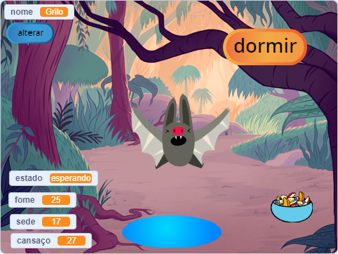
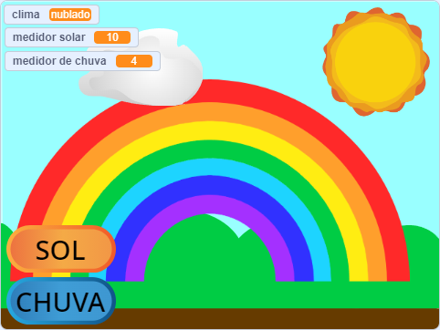

## O que você vai fazer

Crie um animal de estimação virtual, personagem ou simulação da natureza com o qual o usuário possa interagir para ajudá-lo. O seu jogo precisará atender aos critérios do **resumo do projeto**.

Os jogos de bichinhos virtuais são um tipo de jogo em que os usuários interagem com os personagens para atender às necessidades dos personagens. Você pode ter jogado com um pequeno Tamagotchi portátil ou gostado de jogos como Catz e Adote-me! em um computador. Você consegue pensar em algum outro jogo de animal de estimação virtual?

Você irá:
+ Criar um personagem ou simulação que seja divertido ou interessante para interagir
+ Usar qualquer combinação de blocos de `variáveis,`{:class="block3variables"}, blocos `trasmista`{:class="block3events"} e blocos `se`{:class="block3control"}, com as habilidades que você já aprendeu, para permitir que um usuário atenda às necessidades de um personagem
+ Entender como os personagens de jogos e aplicativos são controlados por algoritmos

--- no-print --- --- task ---

### Jogue ▶️ 

Interaja com Grilo, o morcego. O que acontece se você clicar nos atores de comida ou água? Como saber se o morcego está com fome ou com sede?

**Simulador de morcego**: [Ver interior](https://scratch.mit.edu/projects/1049460778/editor){:target="_blank"}

  <iframe allowtransparency="true" width="485" height="402" src="https://scratch.mit.edu/projects/embed/530008968/?autostart=false" frameborder="0"></iframe>

--- /task ---

--- /no-print ---

### RESUMO DO PROJETO: Ajude-me a crescer

Você precisa criar um animal de estimação virtual, uma planta ou outra simulação com a qual o usuário possa interagir para atender às suas necessidades. Você usará **variáveis** para acompanhar as condições do seu ator principal. Ele pode estar feliz, entediado, com sede ou com sono. 

Sua simulação deve:
+ Usar pelo menos uma `variável`{:class="block3variables"} para acompanhar o que o ator principal precisa
+ Ter uma maneira de as variáveis mudarem automaticamente
+ Dar ao usuário uma maneira de melhorar as variáveis para dar ao ator principal o que ele precisa
+ Usar blocos `se`{:class="block3control"} para controlar quando as coisas acontecem
+ Usar blocos `transmita`{:class="block3events"} para a comunicação entre outros atores e o ator principal

Sua simulação poderia:
+ Ter uma mensagem, como gentileza ou manter as plantações saudáveis
+ Alertar o usuário quando os níveis estiverem muito altos ou baixos
+ Permitir que o usuário converse com seu ator, ou mude seu nome

--- no-print ---

### Obtenha ideias 💭

--- task ---

⭐ Compartilhe seu projeto Olhos tolos finalizado para ter a oportunidade de ser apresentado aqui.

Pense no que você escolherá como ator principal. Pode ser um animal de estimação que o usuário cuida, uma pessoa que o usuário ajuda a tomar boas decisões, uma planta ou cultura que o usuário ajuda a cultivar, ou um objeto natural ou de fantasia para o qual o usuário precisa criar as condições certas.

**Agricultor de melancia**: [Ver interior](https://scratch.mit.edu/projects/1049463397/editor){:target="_blank"}

  <iframe allowtransparency="true" width="485" height="402" src="https://scratch.mit.edu/projects/embed/530034441/?autostart=false" frameborder="0"></iframe>

**⭐ Dolly a boneca**: [Ver interior](https://scratch.mit.edu/projects/799871118/editor){:target="_blank"} (featured community project)

  <iframe allowtransparency="true" width="485" height="402" src="https://scratch.mit.edu/projects/embed/531858794/?autostart=false" frameborder="0"></iframe>

**⭐ Dolly the doll**: [See inside](https://scratch.mit.edu/projects/799871118/editor){:target="_blank"} (featured community project)

  <iframe allowtransparency="true" width="485" height="402" src="https://scratch.mit.edu/projects/embed/799871118/?autostart=false" frameborder="0"></iframe>

--- /task ---

--- /no-print ---

--- print-only ---

### Obtenha ideias 💭

Pense no que você escolherá como ator principal. Pode ser um animal de estimação que o usuário cuida, uma pessoa que o usuário ajuda a tomar boas decisões, uma planta ou cultura que o usuário ajuda a cultivar, ou um objeto natural ou de fantasia para o qual o usuário precisa criar as condições certas.

**Ver interior** Projetos de exemplo no 'Este ator precisa de você — Exemplos' Estúdio Scratch: https://scratch.mit.edu/studios/29683913/

  

--- /print-only ---

